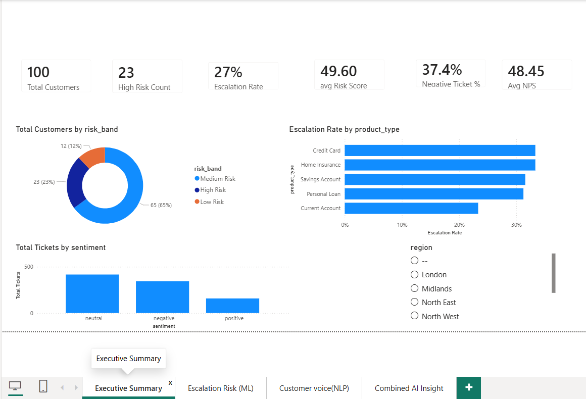
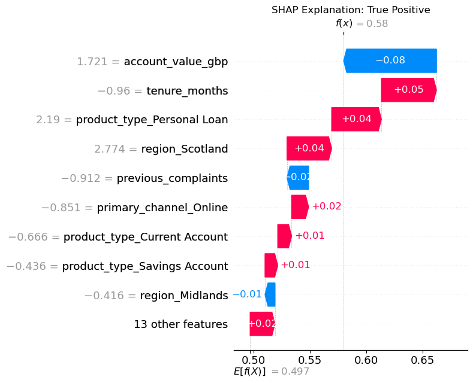
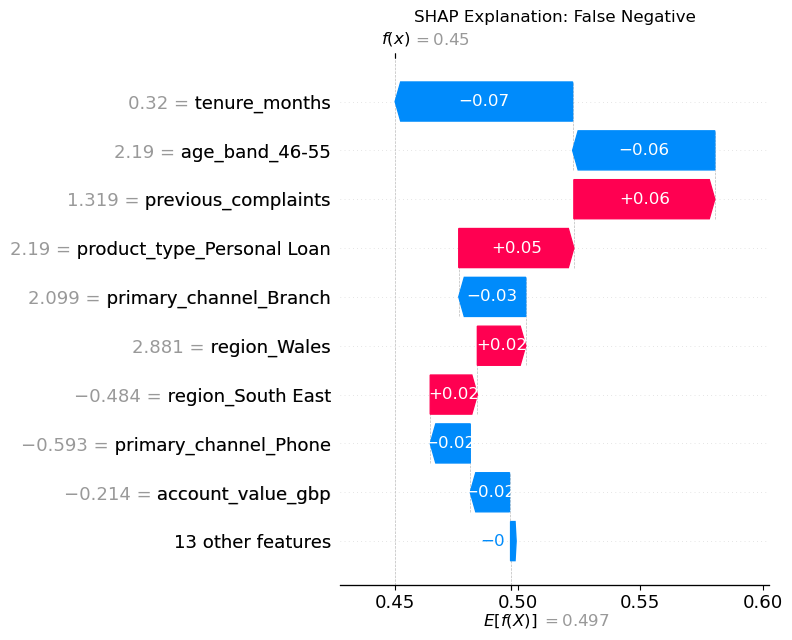
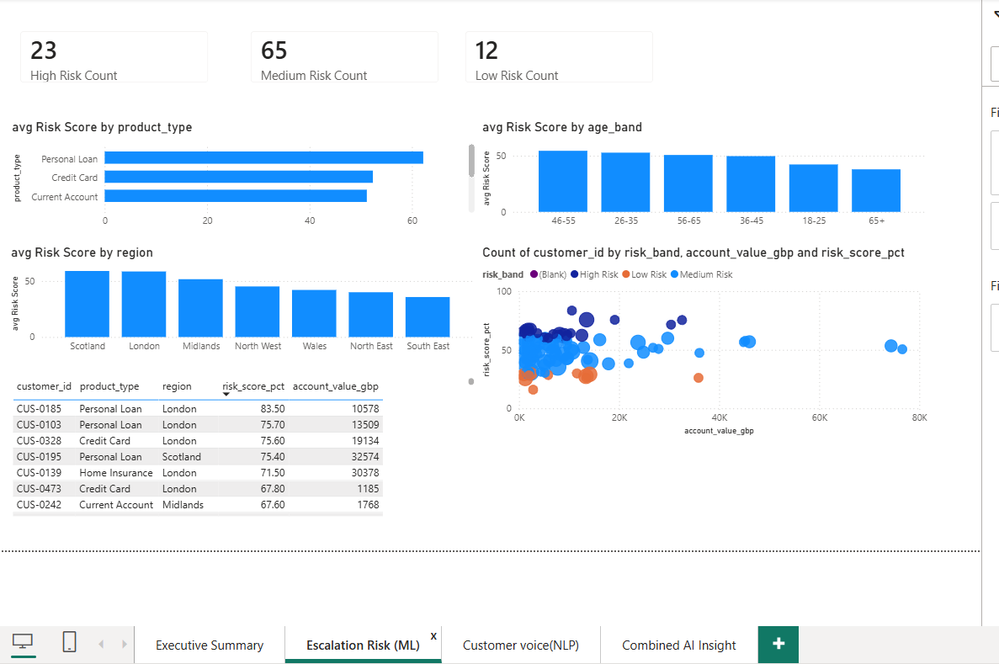

# Meridian Financial Services — AI Customer Intelligence

An end-to-end **AI / ML / NLP** project for a simulated UK fintech: a complaint-escalation classifier with a **SHAP explainability layer**, a **fairness audit** across protected-characteristic proxies, sentiment and key-phrase analysis of support tickets and reviews using **Azure AI Language** and **VADER**, and a four-page **Power BI** dashboard that brings the ML and NLP outputs together for the Head of Customer Experience.

Built for the Data Analyst Career Programme, Module 5 (**AI-900 · Azure AI Fundamentals**).



---

## The business problem

Meridian Financial Services runs current accounts, savings, loans, credit cards, insurance and mortgages. **26.8 % of customers who contact support escalate to the Financial Ombudsman Service (FOS)**, costing roughly **£800 per case** — and escalated customers churn at **38.8 %** against 13.4 % for everyone else. The Head of CX wanted to flag at-risk customers *before* they escalate and understand the real themes behind the star ratings; the Head of Compliance required that any AI decision affecting a customer be explainable to the FCA.

A mid-project "twist" simulated an FCA Consumer Duty request: no model could go live without a per-customer, plain-English explanation of why it was flagged.

## What was built

| Layer | What it does | Tools |
|---|---|---|
| **Framing & governance** | Intended / prohibited uses, protected-characteristic handling, human-in-the-loop process, error costs (£800 false negative vs £25 false positive) | Written submission |
| **EDA** | Escalation rate by product, age band and complaint history | pandas, seaborn |
| **ML classification** | Logistic Regression vs Random Forest (balanced class weights), stratified split, business-cost evaluation at three thresholds | scikit-learn |
| **NLP** | Sentiment and key phrases on 919 tickets and 310 reviews — Path A (Azure AI Language) *and* Path B (VADER + n-gram key phrases) | azure-ai-textanalytics, vaderSentiment |
| **Bias audit** | Accuracy, recall and false-positive rate by age band and product type | pandas |
| **Explainability** | Global SHAP importance plus waterfall charts for a true positive, false positive and false negative, each with a regulator-facing explanation | shap |
| **Dashboard** | Four report pages joining ML risk scores to NLP sentiment on `customer_id` | Power BI, DAX |

## Key findings

**Escalation signal is in the product and the history, not the demographics.** Personal Loan customers escalate most (36.5 %) and Mortgage customers least (18.9 %). Customers with four prior complaints escalate at 60 % versus 25.6 % with none. Age bands sit within a narrow 22–30 % range.

**The tabular model is weak — and the project says so.** On the 100-customer hold-out set both models scored close to random (AUC 0.49 for Logistic Regression, 0.51 for Random Forest). The seven profile features simply do not carry much escalation signal on their own. Rather than dress this up, the write-up treats it as the first Responsible AI finding: a model that cannot separate cases should not be deployed unattended.

**The cost framework still picks a threshold.** With a missed escalation costing 32× more than an unnecessary call, the lowest tested cutoff (0.30) is cheapest — an estimated £63.9k of error cost scaled to the portfolio, versus £93.5k at 0.40 and £104.6k at 0.50 — because it recovers recall (0.44) at the price of cheap false positives.

**Customers are unhappy about billing, specifically.** 37 % of tickets are negative and only 17 % positive (mean VADER compound −0.069). Complaint (−0.35) and Billing (−0.22) are the angriest categories, and Billing is also the second-highest by volume. Azure key-phrase extraction surfaces concrete faults — *billing dispute*, *monthly fee*, *unexplained charge*, *early repayment charge*, *direct debit*, *wrong date* — rather than vague dissatisfaction. Review ratings drifted from 3.67 to 3.52 stars over the year.

**Sentiment alone does not predict escalation.** Average ticket sentiment is almost identical for resolved and unresolved tickets (−0.069 vs −0.068) and for escalated and non-escalated customers (−0.078 vs −0.066). Escalation is driven by what happened, not how the ticket was phrased.

**The bias audit found the failure mode.** At the default 0.5 cutoff the Random Forest recalls almost no real escalations in any age band (recall 0.00 in five of six bands) while the 46–55 band carries the highest false-positive rate (0.11) against an actual escalation rate of 0.22. Recommendation: advisory / shadow mode only, human review of every flag, quarterly FPR and recall monitoring by age band and product.

## Explainability — what the regulator sees

Every prediction is decomposed with SHAP from the model's baseline of 49.7 %. Red bars push risk up, blue bars pull it down.

| True positive (flagged, escalated) | False negative (missed, escalated) |
|---|---|
|  |  |

Plain-English version of the true positive, as written for the FCA examiner: *short tenure, holding a Personal Loan and being based in Scotland each raised this customer's risk; a high account value pulled it back slightly; final score 58 %, above the threshold, so the case was routed to Customer Ops for a proactive call.* All three explanations are in [`docs/Meridian_Written_Submission.docx`](docs/Meridian_Written_Submission.docx).

## Dashboard pages

| Page | Audience | What it shows |
|---|---|---|
| Executive Summary | Head of CX | KPI cards (customers, high-risk count, avg risk score, escalation rate, negative-ticket %, avg NPS), risk-band donut, escalation rate by product, sentiment mix, region slicer |
| Escalation Risk (ML) | Customer Ops | Risk-band counts, avg risk score by product / region / age band, account value vs risk score scatter, customer-level detail table |
| Customer Voice (NLP) | Head of CX & Complaints Manager | Ticket volume and avg sentiment by category, sentiment trend by month, sentiment donut |
| Combined AI Insight | Compliance / CX | Avg sentiment by risk band, risk band × sentiment matrix, escalation rate by sentiment — the join between the two pipelines |



The Power BI file scores **all 500 customers** (the 400 training rows plus the 100 hold-out rows) so that every customer has a risk band for the drill-through table — 105 High Risk, 42 Medium, 352 Low. Those bands reflect in-sample fit and are for navigation, not a performance claim; the hold-out metrics above are the honest numbers.

## Data model

Two tables from the notebook exports, related many-to-one on `customer_id` (single direction):

| Table | Grain | Rows | Key fields |
|---|---|---|---|
| `meridian_ml_output` | one row per customer | 500 | age_band, product_type, region, primary_channel, tenure_months, account_value_gbp, previous_complaints, risk_score_pct, risk_band, y_true, y_pred, escalated, churned, nps_score |
| `meridian_nlp_output` | one row per support ticket | 919 | ticket_date, category, resolution_time_hrs, resolved, ticket_text, sentiment, compound_score |

## DAX measures

Ten measures across the two tables — full definitions plus suggested Responsible-AI monitoring measures (Model Recall, False Positive Rate, Estimated Error Cost) in [`dax/measures.dax`](dax/measures.dax).

| Table | Measures |
|---|---|
| `meridian_ml_output` | Total Customers · High / Medium / Low Risk Count · avg Risk Score · Escalation Rate · Avg NPS |
| `meridian_nlp_output` | Total Tickets · Avg Sentiment · Negative Ticket % |

## Tech stack & skills demonstrated

- **Python / scikit-learn** — binary classification, stratified splitting, class weighting, ROC-AUC, threshold tuning against real error costs
- **SHAP** — TreeExplainer, global importance, per-customer waterfall explanations translated into regulator language
- **Azure AI Language** (Path A) — sentiment analysis and key-phrase extraction via `azure-ai-textanalytics`, batched to the free-tier limits
- **VADER + scikit-learn** (Path B) — open-source sentiment scoring, bigram/trigram key-phrase mining
- **Responsible AI** — protected-characteristic proxy handling, group-wise FPR / recall audit, human-in-the-loop process, deployment conditions
- **Power BI + DAX** — joining ML and NLP outputs into a single model, KPI cards, category and trend analysis
- **Honest reporting** — documenting a weak model as a governance finding rather than hiding it

## Repository structure

```
meridian-ai-customer-intelligence/
├── README.md
├── requirements.txt
├── notebooks/      Meridian_ML_NLP_AI.ipynb  (sections B–G, outputs and charts embedded)
├── data/           meridian_customers.csv, meridian_outcomes.csv, meridian_tickets.csv, meridian_reviews.csv
├── outputs/        meridian_ml_output.csv, meridian_nlp_output.csv, Meridian_AI_Outputs.xlsx
├── powerbi/        Meridian_Financial_Services.pbix
├── dax/            measures.dax
├── docs/           written submission (Sections A, F, H), project brief, reference card, setup guide
└── screenshots/    report pages + notebook/ charts (EDA, ROC, NLP outputs, SHAP)
```

## How to run

1. `pip install -r requirements.txt`
2. Copy the four CSVs from `data/` next to the notebook (or update the paths) and open `notebooks/Meridian_ML_NLP_AI.ipynb` in Jupyter.
3. Path A needs an Azure AI Language resource (free F0 tier) — set `ENDPOINT` and `KEY` in the Section D cell. Skip that cell to run Path B only; every required NLP output is produced by Path B.
4. Open `powerbi/Meridian_Financial_Services.pbix` in Power BI Desktop; data is embedded so it loads without reconnecting.

## Note on the data

All datasets are **synthetic**, generated for the Data Analyst Career Programme. No real customer data is used, and no Azure credentials are stored in this repository.

---

*Mohan Raju Kolikonda · [github.com/Mohan781833](https://github.com/Mohan781833)*
